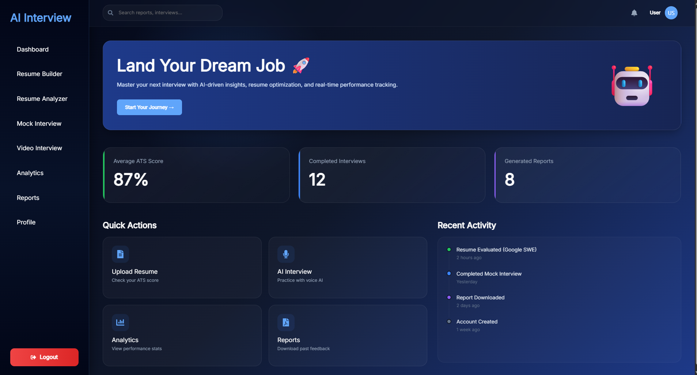
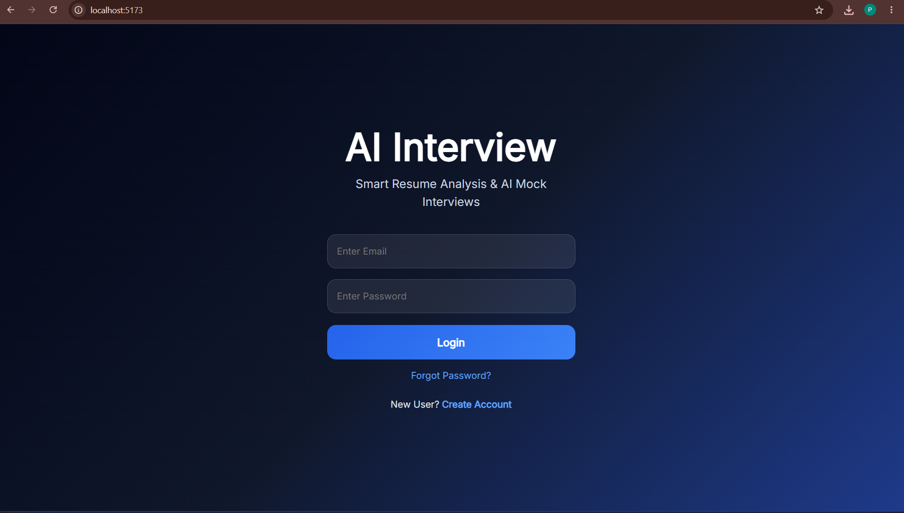
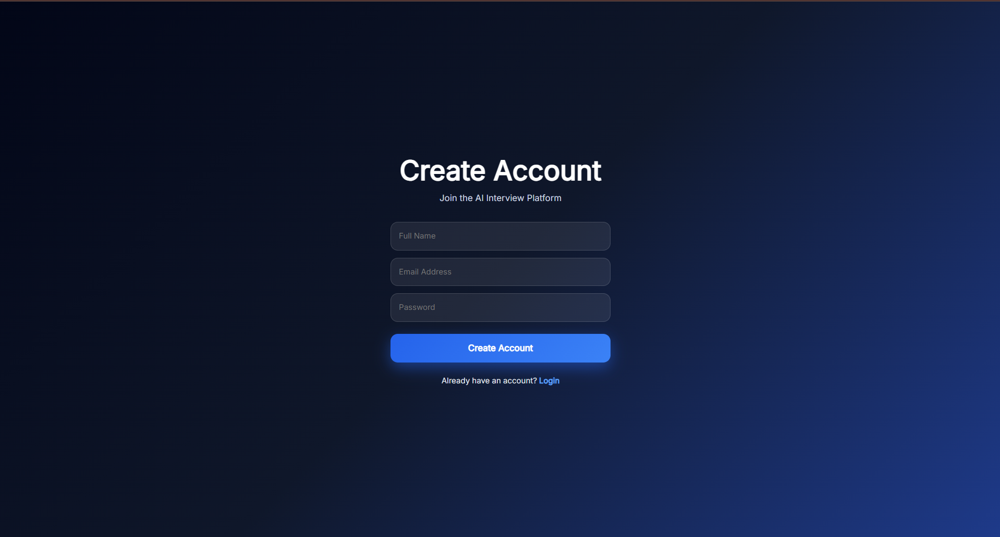
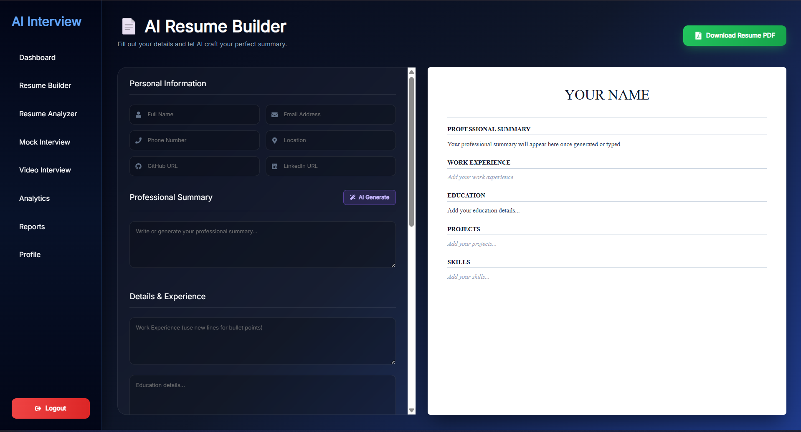
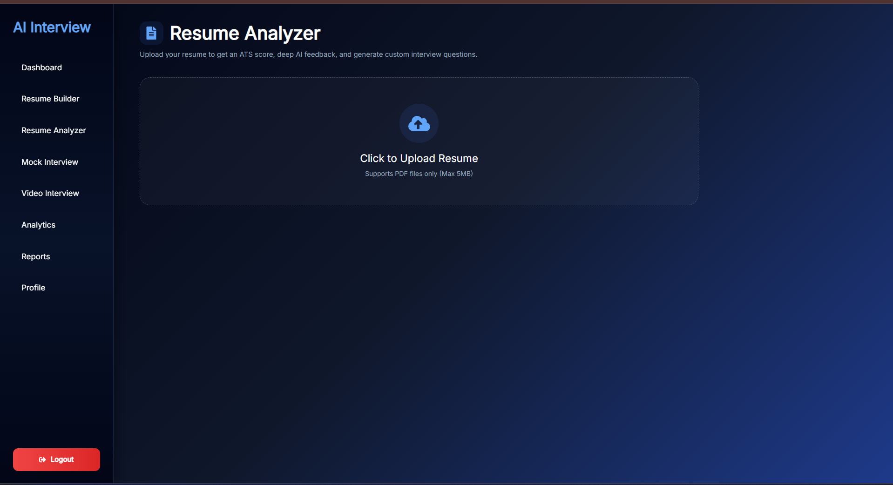
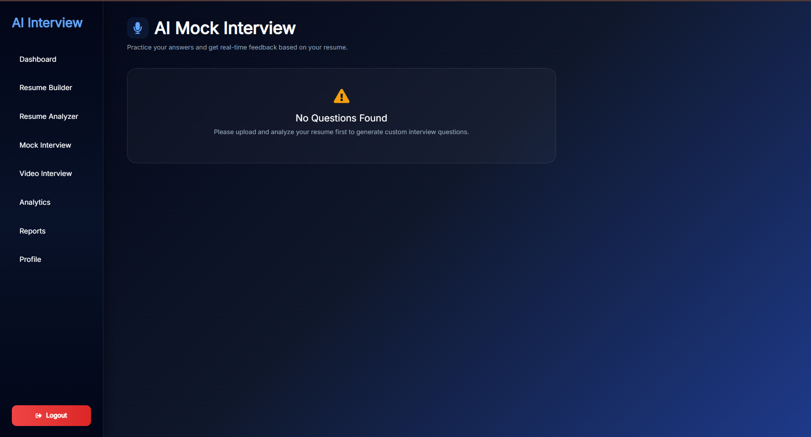
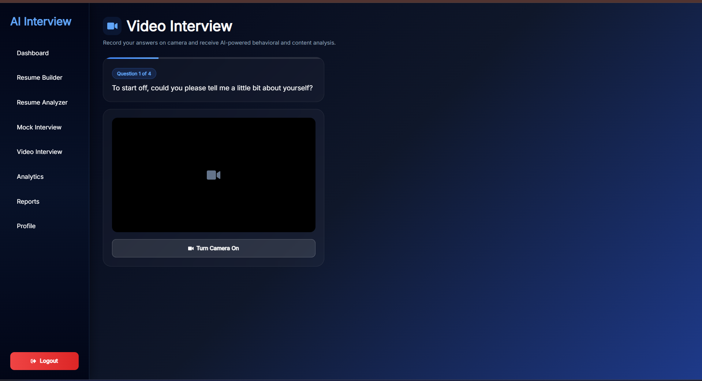
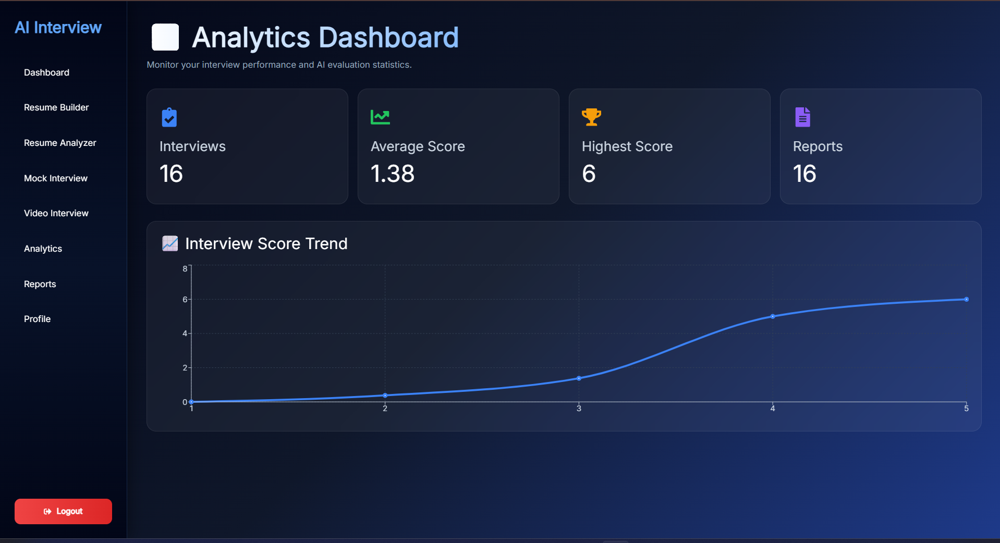
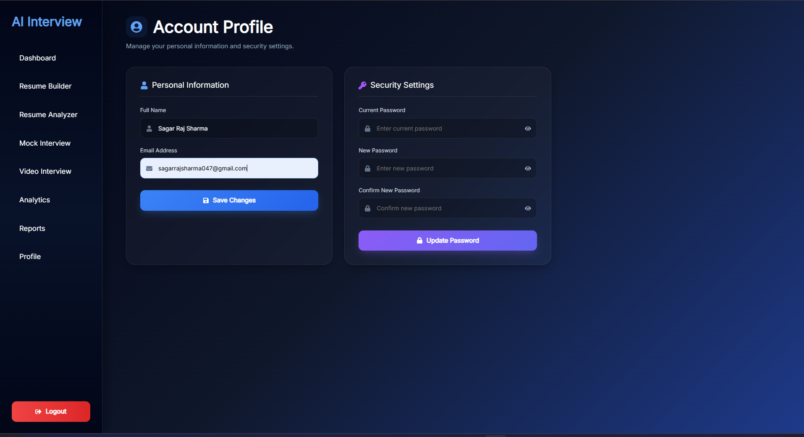
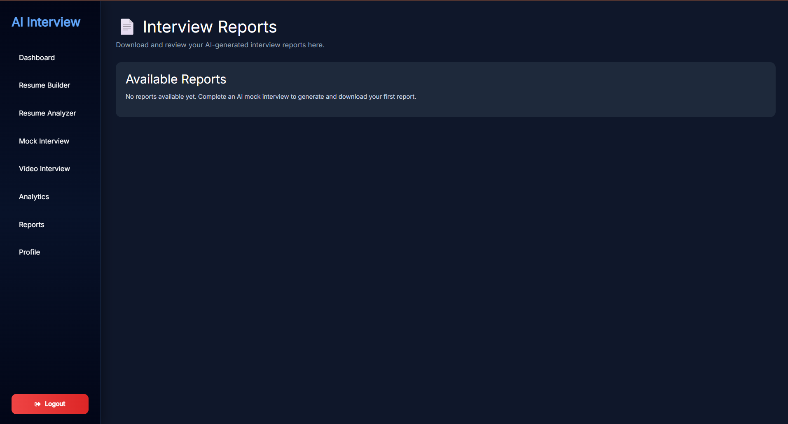

# 🚀 AI Interview Platform

### *An AI-Powered Interview Preparation Platform*


### 📄 Build Professional Resumes • 🤖 Practice AI Interviews • 📊 Track Performance

---

<p>

An intelligent interview preparation platform that combines
Resume Analysis,
ATS Score Prediction,
Resume Builder,
AI Mock Interviews,
Video Interviews,
Performance Analytics,
and Local Large Language Models (LLMs)
into one seamless application.

</p>

</div>

---

# 📑 Table of Contents

- [Project Overview]
- [Features]
- [Technology Stack]
- [System Architecture]
- [Project Structure]
- [Installation Guide]
- [Environment Variables]
- [API Documentation]
- [AI Features]
- [Dashboard]
- [Screenshots]
- [Future Scope]
- [Project Team]
- [Contact]
- [Copyright]

---

# 📖 Project Overview

The **AI Interview Platform** is an end-to-end interview preparation system developed for students, fresh graduates, and professionals.

The application provides a complete ecosystem where users can:

- Create professional resumes
- Analyze resumes using AI
- Improve ATS Score
- Practice AI-generated mock interviews
- Attend video interviews
- Receive AI feedback
- Download interview reports
- Monitor interview performance through analytics

Unlike traditional interview preparation platforms, this project uses **Local AI through Ollama**, ensuring that all resume analysis and interview evaluations remain private.

No resume or interview data is sent to third-party AI services.

---

# 🌟 Why This Project?

Preparing for technical interviews often requires multiple platforms.

This project combines everything into one application.

✔ Resume Builder

✔ Resume Analyzer

✔ ATS Score Checker

✔ AI Interview

✔ Video Interview

✔ Dashboard

✔ Performance Analytics

✔ Report Generation

✔ Local AI

✔ Privacy First

---

# ✨ Key Features

## 🔐 Authentication

- User Registration
- User Login
- JWT Authentication
- Email OTP Verification
- Forgot Password
- Reset Password
- Profile Management

---

## 📄 Resume Builder

Create professional resumes with multiple sections.

Supported Sections

- Personal Information
- Education
- Skills
- Projects
- Experience
- Certifications
- Achievements
- Languages
- Interests

Export resumes directly as PDF.

---

## 📑 Resume Analyzer

Upload your resume and receive detailed AI analysis.

The analyzer provides

- ATS Score
- Resume Summary
- Skills Detection
- Keyword Analysis
- Missing Skills
- Weakness Detection
- Improvement Suggestions

---

## 🤖 AI Mock Interview

Practice interviews generated by AI.

Features include

- Dynamic Question Generation
- Technical Questions
- HR Questions
- Resume-Based Questions
- AI Evaluation
- Interview Feedback
- Performance Score
- PDF Report

---

## 🎥 Video Interview

Simulate real interview environments.

Features

- Webcam Support
- Live Preview
- Interview Timer
- Question Display
- Practice Sessions

---

## 📊 Dashboard

Monitor complete interview preparation.

Dashboard provides

- ATS Score
- Interview Score
- Best Score
- Average Score
- Reports
- Analytics
- History

---

# 🚀 Project Highlights

### ✔ Local AI

Runs completely using Ollama.

### ✔ Privacy

No resume data leaves your computer.

### ✔ Fast

No dependency on cloud APIs.

### ✔ Secure

JWT Authentication

Password Hashing

Protected APIs

### ✔ Responsive

Works on Desktop, Laptop and Tablets.

---

# 🛠 Technology Stack

## Frontend

| Technology | Purpose |
|------------|----------|
| React.js | Frontend Framework |
| Vite | Build Tool |
| Axios | API Requests |
| React Router DOM | Routing |
| React Icons | Icons |
| CSS | Styling |
| Recharts | Analytics Charts |

---

## Backend

| Technology | Purpose |
|------------|----------|
| FastAPI | REST API |
| SQLAlchemy | ORM |
| SQLite | Database |
| Pydantic | Validation |
| Uvicorn | ASGI Server |
| Passlib | Password Hashing |
| Python-dotenv | Environment Variables |

---

## Artificial Intelligence

| Technology | Purpose |
|------------|----------|
| Ollama | Local LLM |
| AI Prompt Engineering | Interview Questions |
| Resume Parsing | Resume Analysis |
| ATS Evaluation | Resume Scoring |

---

## Development Tools

- Git
- GitHub
- VS Code
- Python
- npm
- Node.js

---

# 🏗 System Architecture

```text
                    User
                     │
                     ▼
            React Frontend
                     │
             Axios REST API
                     │
                     ▼
             FastAPI Backend
      ┌──────────┼──────────┐
      ▼          ▼          ▼
 Authentication  AI      Database
      │       Ollama LLM  SQLite
      └──────────┼──────────┘
                 ▼
          PDF Report Engine
```

---

# 📂 Project Structure

```text
AI-Interview-Platform
│
├── backend
│   ├── app
│   │   ├── ai
│   │   ├── config
│   │   ├── core
│   │   ├── models
│   │   ├── routers
│   │   ├── schemas
│   │   ├── services
│   │   ├── utils
│   │   ├── database.py
│   │   └── main.py
│   │
│   ├── uploads
│   ├── generated_resumes
│   ├── video_uploads
│   ├── interview.db
│   ├── requirements.txt
│   ├── run.py
│   └── .env
│
├── frontend
│   ├── src
│   │   ├── assets
│   │   ├── components
│   │   ├── pages
│   │   ├── services
│   │   ├── App.jsx
│   │   └── main.jsx
│   │
│   ├── public
│   ├── package.json
│   ├── vite.config.js
│   └── index.html
│
├── screenshots
│   ├── home.png
│   ├── login.png
│   ├── register.png
│   ├── analytics.png
│   ├── resume-builder.png
│   ├── resume-analysis.png
│   ├── mock-interview.png
│   ├── video-interview.png
│   ├── report.png
│   └── profile.png
│
└── README.md
```

---

---

# ⚙️ Installation Guide

Follow the steps below to set up and run the AI Interview Platform on your local machine.

---

## 📋 Prerequisites

Before starting, ensure the following software is installed on your system.

| Software | Recommended Version |
|----------|---------------------|
| Python | 3.10 or later |
| Node.js | 18 or later |
| npm | Latest |
| Git | Latest |
| Ollama | Latest |

---

## 📥 Clone Repository

```bash
git clone https://github.com/sagar0149/AI-Interview-Platform.git

cd AI-Interview-Platform
```

---

# 🖥️ Backend Setup

Navigate to the backend folder.

```bash
cd backend
```

---

## Create Virtual Environment

Windows

```bash
python -m venv venv
```

Activate Virtual Environment

Windows

```bash
venv\Scripts\activate
```

Linux / macOS

```bash
source venv/bin/activate
```

---

## Install Dependencies

```bash
pip install -r requirements.txt
```

---

## Run Backend

```bash
python run.py
```

Backend will start on

```text
http://127.0.0.1:8000
```

---

# 🌐 Frontend Setup

Move into frontend folder

```bash
cd ../frontend
```

Install dependencies

```bash
npm install
```

Run React application

```bash
npm run dev
```

Frontend runs on

```text
http://localhost:5173
```

---

# 🤖 Ollama Setup

Download Ollama from

https://ollama.com/download

After installation verify

```bash
ollama --version
```

Download a model

```bash
ollama pull llama3
```

or

```bash
ollama pull mistral
```

Start Ollama

```bash
ollama serve
```

Check installed models

```bash
ollama list
```

---

# 🔧 Environment Variables

Create a `.env` file inside the backend folder.

```env
# ===========================
# Application Configuration
# ===========================

HOST=127.0.0.1

PORT=8000

# ===========================
# JWT Authentication
# ===========================

SECRET_KEY=YOUR_SECRET_KEY

ALGORITHM=HS256

ACCESS_TOKEN_EXPIRE_MINUTES=30

# ===========================
# SQLite Database
# ===========================

DATABASE_URL=sqlite:///./interview.db

# ===========================
# Email Configuration
# ===========================

MAIL_USERNAME=your_email@gmail.com

MAIL_PASSWORD=your_app_password

MAIL_FROM=your_email@gmail.com

MAIL_SERVER=smtp.gmail.com

MAIL_PORT=587
```

---

# 📡 API Documentation

The backend is built using **FastAPI** and exposes RESTful APIs.

---

## 🔐 Authentication APIs

| Method | Endpoint | Description |
|---------|----------|-------------|
| POST | `/auth/register` | Register new user |
| POST | `/auth/login` | User login |
| POST | `/auth/forgot-password` | Send OTP |
| POST | `/auth/reset-password` | Reset Password |
| GET | `/auth/profile` | User Profile |
| PUT | `/auth/profile` | Update Profile |

---

## 📄 Resume APIs

| Method | Endpoint | Description |
|---------|----------|-------------|
| POST | `/resume/upload` | Upload Resume |
| POST | `/resume/analyze` | Analyze Resume |
| POST | `/resume/build` | Build Resume |
| GET | `/resume/download/{id}` | Download Resume |
| DELETE | `/resume/delete/{id}` | Delete Resume |

---

## 🤖 Interview APIs

| Method | Endpoint | Description |
|---------|----------|-------------|
| POST | `/interview/start` | Start Interview |
| POST | `/interview/generate` | Generate Questions |
| POST | `/interview/submit-answer` | Submit Answer |
| POST | `/interview/evaluate` | Evaluate Performance |
| GET | `/interview/history` | Interview History |
| GET | `/interview/report/{id}` | Download Report |

---

## 📊 Dashboard APIs

| Method | Endpoint | Description |
|---------|----------|-------------|
| GET | `/dashboard/stats` | Dashboard Statistics |
| GET | `/dashboard/history` | Interview History |
| GET | `/dashboard/reports` | Reports |
| GET | `/dashboard/analytics` | Analytics |

---

# 🔄 Application Workflow

```text
                    User
                      │
                      ▼
              User Registration
                      │
                      ▼
                 User Login
                      │
                      ▼
            JWT Authentication
                      │
        ┌─────────────┼─────────────┐
        ▼                           ▼
 Resume Builder              Resume Upload
        │                           │
        ▼                           ▼
 PDF Generation             Resume Analysis
        │                           │
        └─────────────┬─────────────┘
                      ▼
             AI Interview Module
                      │
          Generate Questions (LLM)
                      │
                      ▼
               Candidate Answers
                      │
                      ▼
              AI Evaluation Engine
                      │
                      ▼
           Interview Performance
                      │
                      ▼
             Dashboard Analytics
                      │
                      ▼
             Download PDF Report
```

---

# 🔒 Security Features

The platform follows secure software development practices.

## Authentication

- JWT Authentication
- Secure Login
- Protected Routes
- Token Validation

---

## Password Security

- Password Hashing using Passlib
- Email OTP Verification
- Password Reset
- Secure Password Storage

---

## Database Security

- SQLAlchemy ORM
- SQLite
- Input Validation
- SQL Injection Protection

---

## API Security

- Request Validation
- Exception Handling
- Protected Endpoints
- Error Responses
- Authentication Middleware

---

## Privacy

Unlike cloud-based AI systems,

✅ Resume data remains on the user's computer.

✅ Interview responses remain private.

✅ No third-party AI APIs are required.

✅ Local AI improves security.

---

# 📦 Backend Dependencies

Major Python packages

- FastAPI
- SQLAlchemy
- Pydantic
- Uvicorn
- Passlib
- ReportLab
- PyPDF
- email-validator
- python-dotenv
- python-multipart
- bcrypt

---

# 📦 Frontend Dependencies

Major frontend libraries

- React
- Vite
- Axios
- React Router DOM
- React Icons
- Recharts

---

# 🚀 Performance

The platform is designed for:

- Fast API responses
- Lightweight database
- Local AI processing
- Responsive UI
- Secure Authentication
- Easy deployment

---

---

# 🤖 AI Features

The AI Interview Platform leverages **Local Large Language Models (LLMs)** through **Ollama** to provide an intelligent, private, and cost-effective interview preparation experience.

Unlike cloud-based AI services, all processing happens **locally**, ensuring that user resumes and interview responses remain private.

---

## 🧠 Resume-Based Question Generation

The platform analyzes uploaded resumes and generates personalized interview questions based on:

- 💻 Programming Languages
- 🛠 Technical Skills
- 📂 Projects
- 🎓 Education
- 💼 Experience
- 📜 Certifications

This creates realistic interview scenarios tailored to the user's profile.

---

## 📊 ATS Resume Analysis

The Resume Analyzer evaluates resumes based on Applicant Tracking System (ATS) standards.

### Analysis Includes

- ATS Score
- Resume Formatting
- Skills Detection
- Keyword Matching
- Missing Skills
- Resume Summary
- Strengths
- Weaknesses
- Improvement Suggestions

---

## 🎤 AI Interview Evaluation

During interviews, the AI evaluates responses based on:

- Technical Accuracy
- Problem Solving
- Communication Skills
- Confidence
- Completeness
- Clarity

Users receive detailed feedback along with suggestions for improvement.

---

## 📄 AI Report Generation

After every interview, the platform automatically generates a downloadable PDF report containing:

- Candidate Information
- Interview Questions
- Submitted Answers
- Individual Question Scores
- Overall Performance
- AI Feedback
- Suggested Improvements

---

# 📊 Dashboard

The Dashboard provides a centralized overview of the user's interview preparation progress.

## Dashboard Features

### 📈 Performance Analytics

- Average Interview Score
- Highest Score
- Lowest Score
- Total Interviews
- Interview History

---

### 📑 Resume Analytics

- ATS Score
- Resume Upload History
- Resume Analysis Reports

---

### 📊 Interactive Charts

Built using **Recharts**, the dashboard visualizes:

- Interview Progress
- Performance Trends
- ATS Improvements
- Historical Performance

---

# 📸 Application Screenshots

> **Store all screenshots in the `screenshots/` folder located in the project root.**

---

## 🏠 Home Page

<p align="center">

</p>

---

## 🔐 Login & Registration

<table>
<tr>
<td align="center">

### Login



</td>

<td align="center">

### Register



</td>
</tr>
</table>

---

## 📄 Resume Module

<table>
<tr>
<td align="center">

### Resume Builder



</td>

<td align="center">

### Resume Analysis



</td>
</tr>
</table>

---

## 🤖 Interview Module

<table>
<tr>
<td align="center">

### Mock Interview



</td>

<td align="center">

### Video Interview



</td>
</tr>
</table>

---

## 📊 Analytics Dashboard

<p align="center">

</p>

---

## 👤 User Profile

<p align="center">

</p>

---

## 📑 Interview Report

<p align="center">

</p>

---

# 🚀 Future Scope

This project can be extended with several advanced features:

- 🎙 Voice-Based AI Interviews
- 😀 Facial Expression Analysis
- 🌍 Multi-language Support
- ☁ Cloud Deployment
- 🐳 Docker Support
- 🗄 PostgreSQL Integration
- 📱 Mobile Application
- 👨‍💼 Recruiter Dashboard
- 📅 Interview Scheduling
- 📧 Email Notifications
- 🤝 Team Interview Mode
- 📈 Advanced Analytics
- 🎯 Company-Specific Interview Sets

---

# 🎓 Learning Outcomes

This project demonstrates practical implementation of:

- Full Stack Web Development
- REST API Development
- Authentication & Authorization
- Database Design
- Artificial Intelligence Integration
- Local LLM Deployment
- Resume Parsing
- PDF Generation
- Data Visualization
- Secure Software Development
- Responsive UI Design

---

# 👥 Project Team

This project was collaboratively developed by:

| Team Member | Contribution |
|-------------|--------------|
| **Sagar Raj Sharma** | **Project Lead**, Backend Development, FastAPI APIs, AI Integration, Database Design, Authentication, Documentation |
| **Shivam Vishwakarma** | Frontend Development, React UI, API Integration, Responsive Design |
| **Roshan Kushwaha** | Testing, Quality Assurance, Documentation & Project Support |

---

# 👨‍💻 Contact

## Sagar Raj Sharma

- 💻 **GitHub:** https://github.com/sagar0149
- 💼 **LinkedIn:** https://www.linkedin.com/in/sagar-raj-sharma-647255383
- 📧 **Email:** sagarraj047@gmail.com

---

## Shivam Vishwakarma

- 💻 **GitHub:** https://github.com/Shivamvishwakarma0122

---

## Roshan Kushwaha

- 💻 **GitHub:** https://github.com/roshancse0608
- 💼 **LinkedIn:**https://www.linkedin.com/in/roshan-kushwaha-a6147a378
- 📧 **Email:** roshankushwaha574@gmail.com

---

# 📜 Copyright

Copyright © 2026 **Sagar Raj Sharma**

All Rights Reserved.

This project was developed as an academic and portfolio project.

No part of this repository may be copied, reproduced, modified, distributed, or published without prior written permission from the author.

You may view this repository for educational and demonstration purposes only.

---

# ⭐ Support

If you found this project useful, please consider giving it a ⭐ **Star** on GitHub.

Your support motivates future improvements and helps others discover the project.

---

# 🙏 Acknowledgements

Special thanks to the following technologies and communities:

- ⚛️ React Team
- ⚡ FastAPI Team
- 🤖 Ollama Team
- 🐍 Python Community
- 🗄 SQLAlchemy Developers
- 📊 Recharts
- 📄 ReportLab
- 🔐 Passlib
- 📑 Pydantic
- ❤️ Open Source Contributors

---

<div align="center">

# ⭐ Thank You for Visiting ⭐

### If you like this project, don't forget to ⭐ Star the repository!

**Made with ❤️ by Team AI Interview Platform**

</div>
