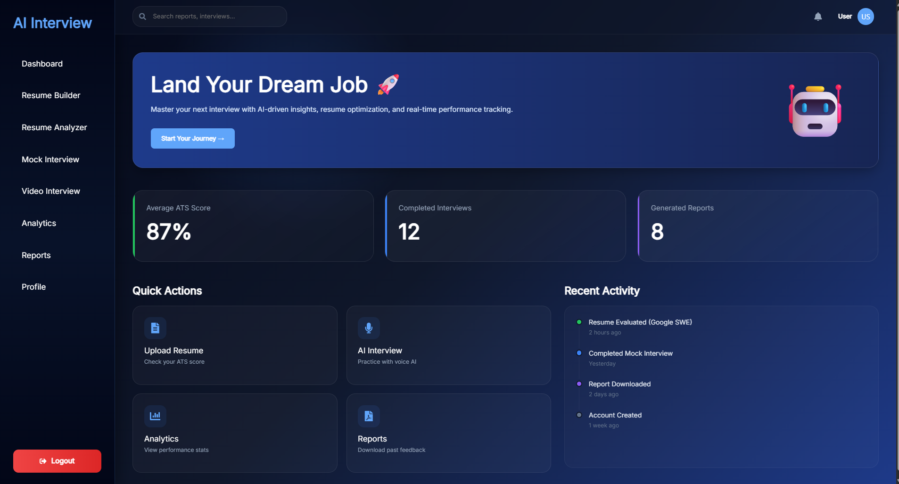
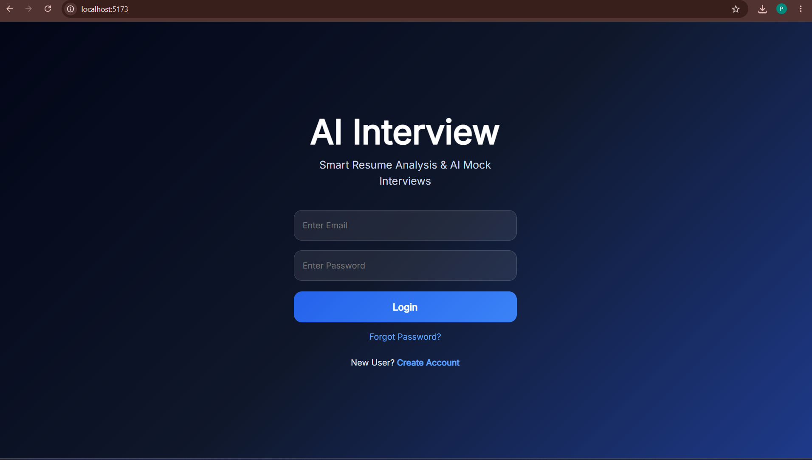
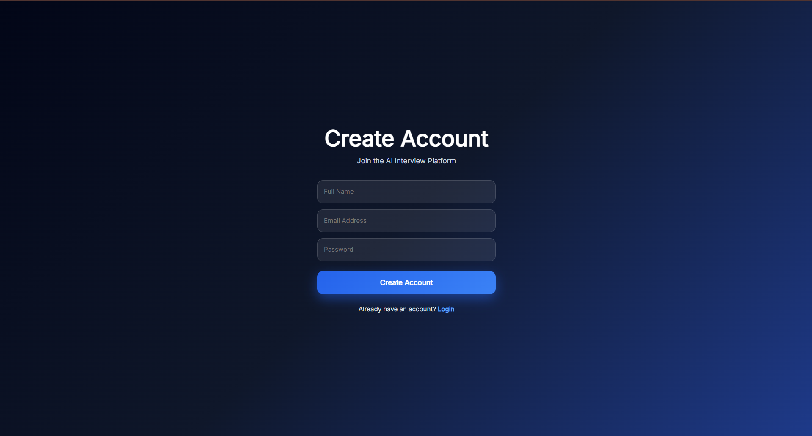
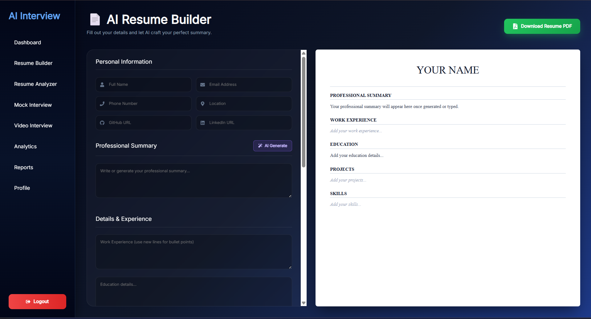
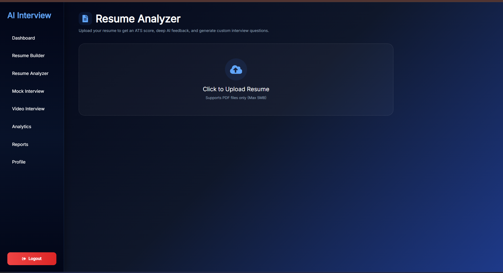
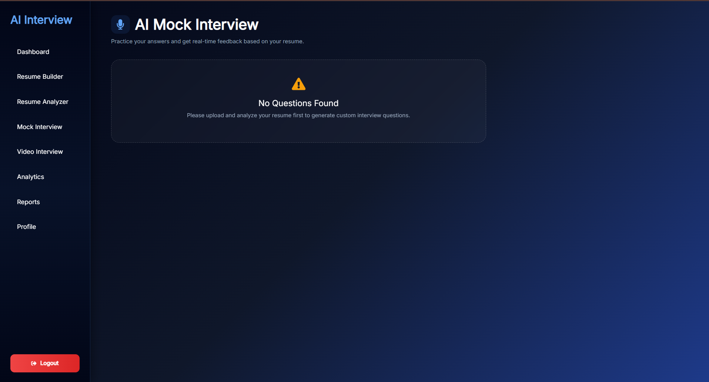
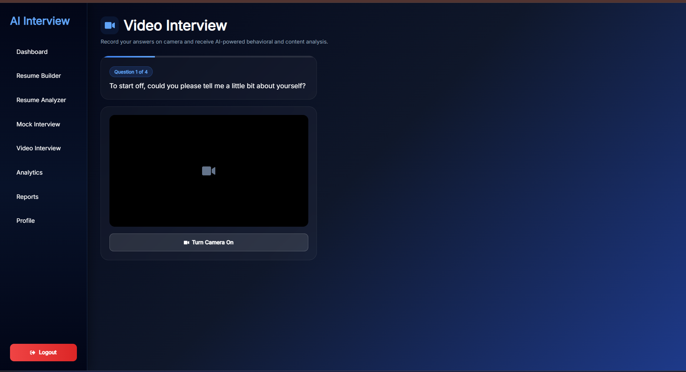
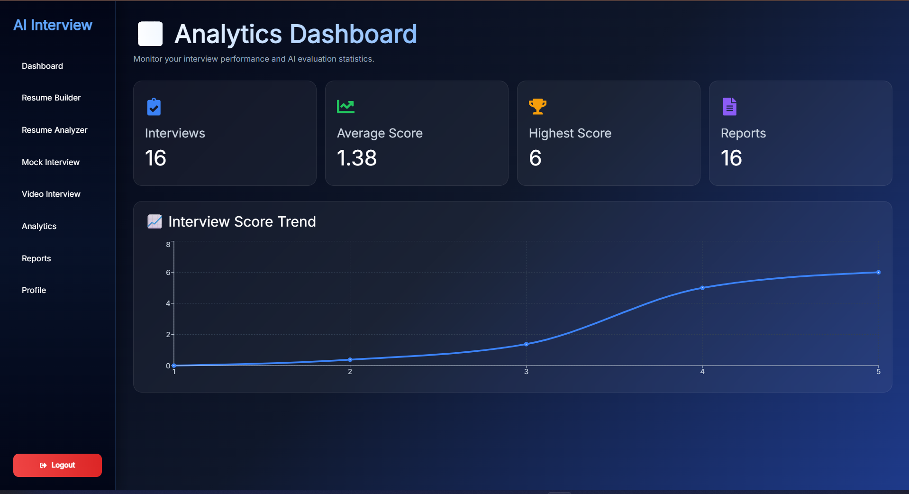
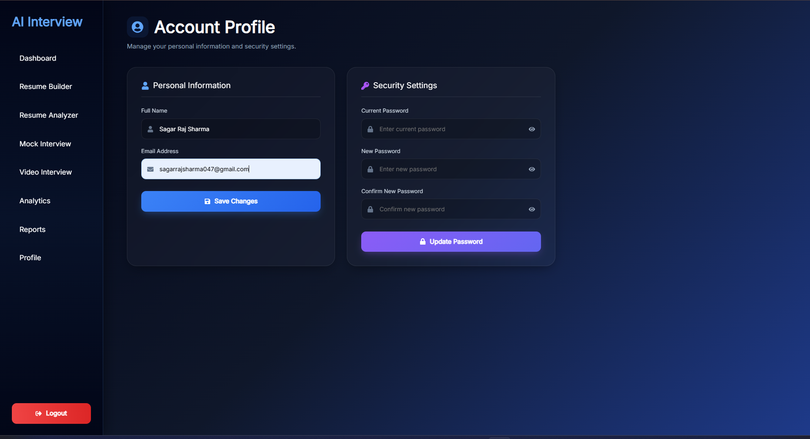
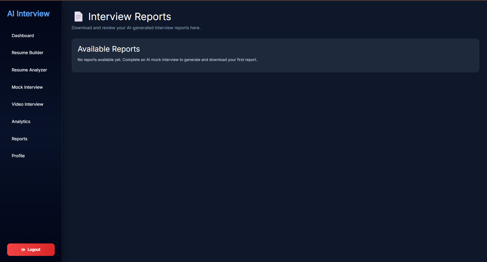

# 🚀 AI Interview Platform

### An AI-Powered Interview Preparation Platform

<p align="center">

### 📄 Build Professional Resumes • 🤖 Practice AI Interviews • 📊 Track Performance

</p>

---

## 📖 Project Overview

The **AI Interview Platform** is a full-stack AI-powered interview preparation system designed for students, fresh graduates, and professionals.

The platform combines multiple interview preparation tools into a single application:

- 📄 Resume Builder
- 📑 Resume Analyzer
- 🎯 ATS Score Prediction
- 🤖 AI Mock Interviews
- 🎥 Video Interviews
- 📊 Performance Analytics
- 📑 Interview Reports
- 🔐 Secure Authentication
- ✉️ Email OTP Verification
- 👤 Profile Management

The platform uses the **Google Gemini API** to generate interview questions, analyze resumes, evaluate interview responses, and provide AI-powered feedback.

---

# 🌟 Why This Project?

Preparing for technical interviews often requires using multiple different platforms.

The **AI Interview Platform** brings the complete preparation process into one application.

### Platform Highlights

✔ Professional Resume Builder  
✔ AI Resume Analyzer  
✔ ATS Score Evaluation  
✔ AI-Generated Mock Interviews  
✔ Resume-Based Interview Questions  
✔ Video Interview Practice  
✔ AI Interview Evaluation  
✔ Performance Analytics  
✔ Interview History  
✔ PDF Report Generation  
✔ Secure Authentication  
✔ Gemini AI Integration  

---

# ✨ Key Features

## 🔐 Authentication

The platform provides secure user authentication and account management.

Features include:

- User Registration
- User Login
- JWT Authentication
- Email OTP Verification
- Forgot Password
- Reset Password
- Profile Management
- Protected APIs

---

# 📄 Resume Builder

Create professional resumes using the built-in resume builder.

### Supported Sections

- Personal Information
- Education
- Skills
- Projects
- Experience
- Certifications
- Achievements
- Languages
- Interests

Users can generate and download professional resumes as PDF files.

---

# 📑 Resume Analyzer

Upload your resume and receive AI-powered analysis.

### Analysis Includes

- ATS Score
- Resume Summary
- Skills Detection
- Keyword Analysis
- Missing Skills
- Strength Detection
- Weakness Detection
- Improvement Suggestions
- Resume-Based Recommendations

The analyzer helps users identify areas that can be improved before applying for jobs.

---

# 🤖 AI Mock Interview

The AI Interview module provides an interactive interview preparation environment.

### Features

- Dynamic Question Generation
- Technical Questions
- HR Questions
- Resume-Based Questions
- AI-Generated Questions
- Interview Evaluation
- Performance Score
- AI Feedback
- Improvement Suggestions
- Interview Reports

The **Google Gemini API** is used to generate questions and evaluate candidate responses.

---

# 🎥 Video Interview

The Video Interview module provides a simulated interview environment.

### Features

- Webcam Support
- Live Camera Preview
- Interview Timer
- Question Display
- Practice Sessions
- Interview Environment Simulation

This helps candidates become comfortable with real-world interview environments.

---

# 📊 Dashboard

The dashboard provides a centralized overview of the user's interview preparation progress.

### Dashboard Provides

- ATS Score
- Interview Score
- Best Score
- Average Score
- Completed Interviews
- Generated Reports
- Interview History
- Analytics
- Quick Actions

---

# 🧠 Google Gemini AI Integration

The platform uses the **Google Gemini API** as its AI engine.

Gemini is used for multiple AI-powered features throughout the application.

### AI Capabilities

#### 🤖 Interview Question Generation

Gemini generates interview questions based on:

- Selected job role
- Technical skills
- Resume information
- Projects
- Experience
- Education

#### 📑 Resume Analysis

Gemini can assist with analyzing resume content and generating:

- Resume summaries
- Skill identification
- Missing skill recommendations
- Resume improvement suggestions
- ATS-related feedback

#### 🎤 Interview Evaluation

Candidate answers can be evaluated based on:

- Technical Accuracy
- Relevance
- Problem Solving
- Communication
- Clarity
- Completeness
- Overall Performance

#### 📊 AI Feedback

The platform generates useful feedback to help candidates understand their strengths and areas for improvement.

---

# 🛠 Technology Stack

## Frontend

| Technology | Purpose |
|------------|---------|
| React.js | Frontend Framework |
| Vite | Build Tool |
| Axios | API Requests |
| React Router DOM | Client-side Routing |
| React Icons | UI Icons |
| CSS | Styling |
| Recharts | Analytics Charts |

---

## Backend

| Technology | Purpose |
|------------|---------|
| FastAPI | REST API Framework |
| SQLAlchemy | ORM |
| SQLite | Database |
| Pydantic | Data Validation |
| Uvicorn | ASGI Server |
| Passlib | Password Hashing |
| Python-dotenv | Environment Variables |
| ReportLab | PDF Generation |

---

## Artificial Intelligence

| Technology | Purpose |
|------------|---------|
| Google Gemini API | AI Processing |
| Gemini Generative AI | Interview Questions & Evaluation |
| AI Prompt Engineering | AI Response Generation |
| Resume Parsing | Resume Analysis |
| ATS Evaluation | Resume Scoring |

---

## Development Tools

- Git
- GitHub
- VS Code
- Python
- Node.js
- npm

---

# 🏗 System Architecture

```text
                         User
                           │
                           ▼
                  React Frontend
                           │
                     Axios REST API
                           │
                           ▼
                   FastAPI Backend
                           │
            ┌──────────────┼──────────────┐
            │              │              │
            ▼              ▼              ▼
     Authentication     Gemini AI       Database
            │              │            SQLite
            │              │
            │              ▼
            │       AI Processing
            │              │
            └──────────────┼──────────────┐
                           │              │
                           ▼              ▼
                    Resume Analysis   Interview
                                          │
                                          ▼
                                  AI Evaluation
                                          │
                                          ▼
                                  PDF Report Engine

                                  AI-Interview-Platform
│
├── backend
│   ├── app
│   │   ├── ai
│   │   ├── config
│   │   ├── core
│   │   ├── models
│   │   ├── routers
│   │   ├── schemas
│   │   ├── services
│   │   ├── utils
│   │   ├── database.py
│   │   └── main.py
│   │
│   ├── uploads
│   ├── generated_resumes
│   ├── video_uploads
│   ├── interview.db
│   ├── requirements.txt
│   ├── run.py
│   └── .env
│
├── frontend
│   ├── public
│   ├── src
│   │   ├── assets
│   │   ├── components
│   │   ├── pages
│   │   ├── services
│   │   ├── App.jsx
│   │   └── main.jsx
│   │
│   ├── package.json
│   ├── vite.config.js
│   └── index.html
│
├── screenshots
│   ├── home.png
│   ├── login.png
│   ├── register.png
│   ├── analytics.png
│   ├── resume-builder.png
│   ├── resume-analysis.png
│   ├── mock-interview.png
│   ├── video-interview.png
│   ├── report.png
│   └── profile.png
│
└── README.md
⚙️ Installation Guide

Follow the steps below to run the AI Interview Platform locally.

📋 Prerequisites

Before starting, install the following:

Software	Recommended Version
Python	3.10 or later
Node.js	18 or later
npm	Latest
Git	Latest

You will also need a Google Gemini API key for the AI-powered features.
📥 Clone Repository
git clone https://github.com/sagar0149/AI-Interview-Platform.git


cd AI-Interview-Platform
🖥️ Backend Setup

Navigate to the backend:

cd backend
Create Virtual Environment
Windows
python -m venv venv

Activate the environment:

venv\Scripts\activate
Linux / macOS
python3 -m venv venv

Activate:

source venv/bin/activate
Install Dependencies
pip install -r requirements.txt

▶️ Run Backend

From the backend directory:

python run.py

The backend will start at:

http://127.0.0.1:8000

FastAPI documentation will be available at:

http://127.0.0.1:8000/docs
🌐 Frontend Setup

Open another terminal.

Navigate to the frontend:

cd frontend

Install dependencies:

npm install

Start the development server:

npm run dev

The frontend will run at:

http://localhost:5173
🔑 Gemini API Configuration

The AI features require a valid Google Gemini API key.

Add the API key to the backend .env file:

GEMINI_API_KEY=YOUR_GEMINI_API_KEY

The backend uses this key to communicate with the Gemini AI service.

AI Features Requiring Gemini
Resume Analysis
AI Interview Question Generation
Interview Evaluation
AI Feedback
Resume-Based Questions
📡 API Documentation

The backend is built using FastAPI and provides RESTful APIs.

🔐 Authentication APIs
Method	Endpoint	Description
POST	/auth/register	Register new user
POST	/auth/login	User login
POST	/auth/forgot-password	Send password reset OTP
POST	/auth/reset-password	Reset password
GET	/auth/profile	Get user profile
PUT	/auth/profile	Update profile
📄 Resume APIs
Method	Endpoint	Description
POST	/resume/upload	Upload resume
POST	/resume/analyze	Analyze resume
POST	/resume/build	Build resume
GET	/resume/download/{id}	Download resume
DELETE	/resume/delete/{id}	Delete resume
🤖 Interview APIs
Method	Endpoint	Description
POST	/interview/start	Start interview
POST	/interview/generate	Generate interview questions
POST	/interview/submit-answer	Submit answer
POST	/interview/evaluate	Evaluate interview performance
GET	/interview/history	Get interview history
GET	/interview/report/{id}	Download interview report
GET	/interview/analytics	Get interview analytics
📊 Dashboard APIs
Method	Endpoint	Description
GET	/dashboard/stats	Dashboard statistics
GET	/dashboard/history	Interview history
GET	/dashboard/reports	Reports
GET	/dashboard/analytics	Analytics

API endpoint names should be kept synchronized with the actual FastAPI routes implemented in the backend.

🔄 Application Workflow

                         User
                           │
                           ▼
                    Registration
                           │
                           ▼
                       Login
                           │
                           ▼
                  JWT Authentication
                           │
             ┌─────────────┴─────────────┐
             │                           │
             ▼                           ▼
       Resume Builder              Resume Upload
             │                           │
             ▼                           ▼
       PDF Generation              AI Analysis
                                         │
                                         ▼
                                  ATS Evaluation
                                         │
                         ┌───────────────┘
                         │
                         ▼
                  AI Mock Interview
                         │
                         ▼
                 Generate Questions
                         │
                         ▼
                  Candidate Answers
                         │
                         ▼
                  Gemini Evaluation
                         │
                         ▼
                Interview Performance
                         │
                         ▼
                  Dashboard Analytics
                         │
                         ▼
                  PDF Interview Report


                  🔒 Security Features
Authentication
JWT Authentication
Protected APIs
Token Validation
Secure Login
Protected Application Routes
Password Security
Password Hashing
OTP Verification
Password Reset
Secure Password Storage
Database Security
SQLAlchemy ORM
Input Validation
Parameterized Database Operations
SQLite Database
API Security
Request Validation
Exception Handling
Protected Endpoints
Authentication Middleware
Structured Error Responses
🔐 API Key Security

The Gemini API key is stored in the backend environment configuration.

GEMINI_API_KEY=YOUR_GEMINI_API_KEY

The API key should never be hard-coded into frontend React files or committed to GitHub.

📦 Backend Dependencies

Major Python packages include:

FastAPI
SQLAlchemy
Pydantic
Uvicorn
Passlib
ReportLab
PyPDF
email-validator
python-dotenv
python-multipart
bcrypt
Google Gemini AI SDK
📦 Frontend Dependencies

Major frontend libraries include:

React
Vite
Axios
React Router DOM
React Icons
Recharts
🚀 Performance

The platform is designed for:

Fast API communication
Lightweight SQLite database
Efficient AI integration
Responsive UI
Secure Authentication
Modular Architecture
Easy Local Development
🤖 AI Features

The AI Interview Platform uses Google Gemini to provide intelligent interview preparation features.

🧠 Resume-Based Question Generation

The system can generate personalized interview questions using information such as:

Programming Languages
Technical Skills
Projects
Education
Experience
Certifications
Resume Content

This helps create interview scenarios that are relevant to the candidate.

📊 ATS Resume Analysis

The Resume Analyzer evaluates resumes according to ATS-oriented criteria.

Analysis Includes
ATS Score
Resume Formatting
Skills Detection
Keyword Analysis
Missing Skills
Resume Summary
Strengths
Weaknesses
Improvement Suggestions
🎤 AI Interview Evaluation

The AI evaluates candidate responses based on criteria such as:

Technical Accuracy
Problem Solving
Relevance
Communication
Clarity
Completeness
Overall Quality

Users receive feedback and suggestions for improvement.

📄 AI Report Generation

After an interview, the platform can generate a downloadable PDF report containing:

Candidate Information
Interview Questions
Submitted Answers
Individual Question Scores
Overall Performance
AI Feedback
Suggested Improvements
📊 Dashboard

The Dashboard provides a centralized overview of the user's interview preparation progress.

📈 Performance Analytics

The analytics module can display:

Average Interview Score
Highest Score
Total Interviews
Interview History
Performance Trends
📑 Resume Analytics

The platform can provide:

ATS Score
Resume Analysis
Resume History
Resume Improvement Suggestions
📊 Interactive Charts

The analytics interface uses Recharts to visualize:

Interview Progress
Performance Trends
Historical Scores
Interview Statistics
📸 Application Screenshots

Store application screenshots inside the screenshots/ directory.

🏠 Home Page
<p align="center">  </p>
🔐 Login & Registration
<table> <tr> <td align="center">

<b>Login</b>

<br/>  </td> <td align="center">

<b>Register</b>

<br/>  </td> </tr> </table>
📄 Resume Module
<table> <tr> <td align="center">

<b>Resume Builder</b>

<br/>  </td> <td align="center">

<b>Resume Analysis</b>

<br/>  </td> </tr> </table>
🤖 Interview Module
<table> <tr> <td align="center">

<b>Mock Interview</b>

<br/>  </td> <td align="center">

<b>Video Interview</b>

<br/>  </td> </tr> </table>
📊 Analytics Dashboard
<p align="center">  </p>
👤 User Profile
<p align="center">  </p>
📑 Interview Report
<p align="center">  </p>
🚀 Future Scope

The project can be extended with additional features such as:

🎙 Advanced Voice-Based AI Interviews
😀 Facial Expression Analysis
🌍 Multi-language Interview Support
☁ Cloud Deployment
🐳 Docker Support
🗄 PostgreSQL Integration
📱 Mobile Application
👨‍💼 Recruiter Dashboard
📅 Interview Scheduling
📧 Email Notifications
🤝 Team Interview Mode
📈 Advanced Analytics
🎯 Company-Specific Interview Sets
🧠 More Advanced AI Evaluation
🎓 Learning Outcomes

This project demonstrates practical implementation of:

Full-Stack Web Development
REST API Development
Authentication & Authorization
Database Design
Artificial Intelligence Integration
Gemini API Integration
Resume Parsing
ATS Evaluation
PDF Generation
Data Visualization
Secure Software Development
Responsive UI Design
👥 Project Team

This project was collaboratively developed by:

Team Member	Contribution
Sagar Raj Sharma	Project Lead, Backend Development, FastAPI APIs, AI Integration, Database Design, Authentication, Documentation
Shivam Vishwakarma	Frontend Development, React UI, API Integration, Responsive Design
Roshan Kushwaha	Testing, Quality Assurance, Documentation & Project Support
👨‍💻 Contact
Sagar Raj Sharma
💻 GitHub: https://github.com/sagar0149
💼 LinkedIn: https://www.linkedin.com/in/sagar-raj-sharma-647255383
📧 Email: sagarraj047@gmail.com
Shivam Vishwakarma
💻 GitHub: https://github.com/Shivamvishwakarma0122
📧 Email: shivamvishwakarma0122@gmail.com
Roshan Kushwaha
💻 GitHub: https://github.com/roshancse0608
💼 LinkedIn: https://www.linkedin.com/in/roshan-kushwaha-a6147a378
📧 Email: roshankushwaha574@gmail.com
📜 Copyright

Copyright © 2026 Sagar Raj Sharma

All Rights Reserved.

This project was developed as an academic and portfolio project.

No part of this repository may be copied, reproduced, modified, distributed, or published without prior written permission from the author.

The repository may be viewed for educational and demonstration purposes.

⭐ Support

If you found this project useful, please consider giving it a ⭐ Star on GitHub.

Your support helps the project grow and motivates future improvements.

🙏 Acknowledgements

Special thanks to the technologies and communities used in this project:

⚛️ React
⚡ FastAPI
🤖 Google Gemini
🐍 Python
🗄 SQLAlchemy
📊 Recharts
📄 ReportLab
🔐 Passlib
📑 Pydantic
❤️ Open Source Community
<div align="center">
⭐ Thank You for Visiting ⭐
If you like this project, don't forget to ⭐ Star the repository!

Made with ❤️ by Team AI Interview Platform

</div> ```